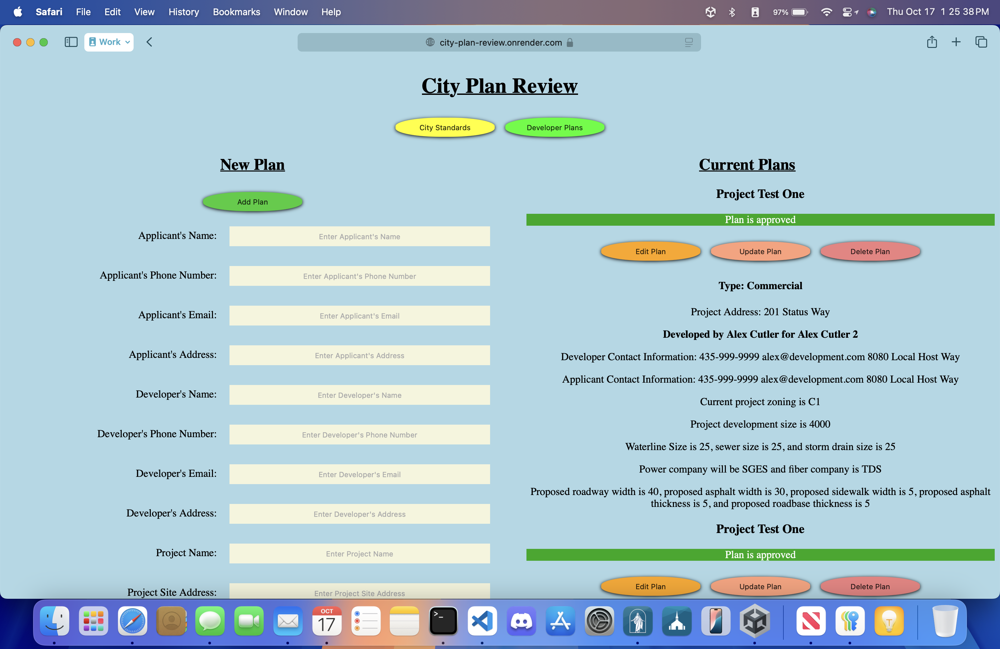
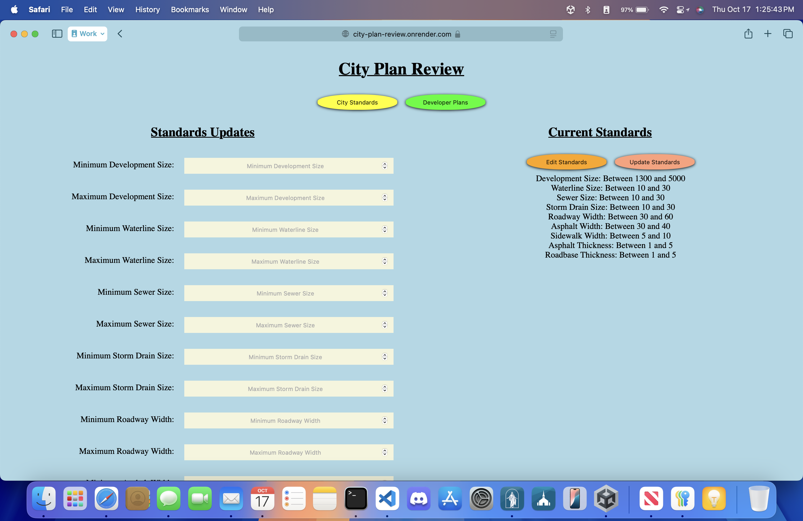

# City Plan Review

This is my midterm project for my SE-4200 Web Application Development 2 class.  It is a city plan review and approval web application to automate the approval process of land development plans in cities.  The backend uses Express.js built on Node.js for the server and is connected to a MongoDB database to store the data.  The frontend uses Vue.js for interactivity with vanilla HTML and CSS for the styling.  I personally deployed it using Render.

